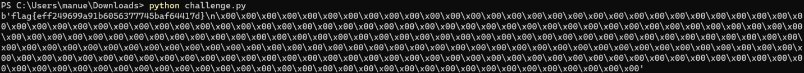

# Seed Labs - Public-Key Infrastructure Lab

## Setup

De modo a preparar os nossos sistemas para este lab, adicionámos novas entradas nos hosts conhecidos pela máquina virtual (em `/etc/hosts`) e executámos os containers fornecidos.
```
10.9.0.80 www.bank32.com
10.9.0.80 www.ye2023.com
```

## Tarefa 1: "Becoming a Certificate Authority (CA)"

O objetivo desta tarefa é criar uma nova Autoridade de Certificação. Para tal, seguimos os seguintes passos, dentro da nossa pasta de trabalho local:
1. Configurar o OpenSSL
    - Copiámos o ficheiro certificado default para o diretório local usando `cp /usr/lib/ssl/openssl.cnf . ` e descomentámos a linha `unique_subject``
    
    - Criámos os diretórios `demoCA/` e `demoCA/newcerts`, usando `mkdir -p demoCA/newcerts`
    - Em seguida, criámos a base de dados `index.txt`, usando `touch index.txt`
    - Criámos o arquivo `serial`, usando `echo 1000 > serial`
2. Fazer o setup da CA, utilizando `openssl req -x509 -newkey rsa:4096 -sha256 -days 3650 -keyout ca.key -out ca.crt`
    - Neste processo, utilizámos os seguintes dados:
        ```
        - passphrase: dees
        - nome do país: PT
        - região: Porto
        - cidade: Porto
        - organização: Feup
        - secção: Uporto
        - nome: l14g01
        - email: l14g01@example.com
        ```
3. Para ver o conteúdo dos ficheiros gerados, decodificamos o certificado X509 e a chave RSA:
    ```
    openssl x509 -in ca.crt -text -noout
    openssl rsa -in ca.key -text -noout
    ```

* Podemos verificar qque é um certificado CA, visto que na secção `Certificate > Data > X509v3 extensions > X509v3 Basic Constraints` existe um atributo/propriedade `CA`  que está a verdadeiro:

    

* Podemos observar que na secção `X509v3 extensions`, existem dois identificadores de chave: o Subject Key Identifier e o Authority Key Identifier. Como ambos são iguais, significa que a autoridade é o sujeito e, como tal, este certificado é **self-signed**.

    

* Ao analisarmos o conteúdo do certificado e o conteúdo da chave, podemos tirar as seguintes conclusões:
    * O modulus `n` encontra-se secção `modulus`.
    
    * O expoente público `e` e o expoente privado `d` encontram-se nas secções `publicExponent` e `privateExponent`, respetivamente.
    
    * Os dois números secretos estão nas secções `prime1` e `prime2`.
    

## Tarefa 2 - "Generating a Certificate Request for Your Web Server"

* Através do comando `openssl req -newkey rsa:2048 -sha256 -keyout server.key -out server.csr -subj "/CN=www.ye2023.com/O=L14G01 INC./C=PT" -passout pass:dees - -addext "subjectAltName = DNS:www.ye2023.com, DNS:www.ye2023A.com, DNS:www.ye2023B.com"
`, gerámos um certificado para o nosso servidor web.
    * Isto irá criar um CSR para o domínio www.ye2023.com. Existem também alguns nomes alternativos anexados à solicitação, o que significa que o certificado gerado também funcionará com os domínios www.ye2023A.com e www.ye2023B.com.

## Tarefa 3 - "Generating a Certificate for your server"

Para gerar um certificado para o nosso próprio servidor www.ye2023.com, foi necessário:
1. No ficheiro `openssl.cnf`, descomentar a linha:
```
[CA_default]
...
copy_extensions = copy
```
2. Criar o certificado, usando o comando `openssl ca -config openssl.cnf -policy policy_anything -md sha256 -days 3650 -in server.csr -out server.crt -batch -cert ca.crt -keyfile ca.key`
    * Foi criado um `server.crt` para o servidor assinado pela CA.
    

3. Após correr o comando `openssl x509 -in server.crt -text -noout`, podemos verificar que os nomes alternativos estão incluídos no conteúdo do certificado
    

## Tarefa 3 - "Deploying Certificate in an Apache-Based HTTPS Website"

* Comecámos por configurar o servidor de Apache, modificando o ficheiro `bank32_apache_ssl.conf`. Seguindo o exemplo do bank32, o nosso ficheiro configuração ficou o seguinte:
```
<VirtualHost *:443> 
    DocumentRoot /var/www/ye2023
    ServerName www.ye2023.com
    ServerAlias www.ye2023A.com
    ServerAlias www.ye2023B.com
    DirectoryIndex index.html
    SSLEngine On 
    SSLCertificateFile /certs/ye2023.crt
    SSLCertificateKeyFile /certs/ye2023.key
</VirtualHost>

<VirtualHost *:80> 
    DocumentRoot /var/www/ye2023
    ServerName www.ye2023.com
    DirectoryIndex index_red.html
</VirtualHost>

# Set the following gloal entry to suppress an annoying warning message
ServerName localhost
```
* Começámos o servidor de Apache, usando `service apache2 start` na shell do docker
* Acedemos ao site `https://ye2023.com`, mas verificamos que a ligação era insegura, ou seja, não estava encriptada


* Para tornar a nossa ligação segura, adicionamos o certificado CA que geramos às autoridades no browser, em `about:preferences#privacy -> Certificates -> View Certificates -> Authorities -> Import`, e verificamos que a ligação passou a ser segura:


## Tarefa 5 - "Launching a Man-In-The-Middle Attack"

* Nesta tarefa, escolhemos o `example.com` para realizar as etapas.
1. Comecámos por adicionar a seguinte linha ao `/etc/hosts`:
    ```
    10.9.0.80   www.example.com
    ```
2. Mudámos o ficheiro `bank32_apache_ssl.conf` para:
    ```html
    <VirtualHost *:443>
    DocumentRoot /var/www/ye2023
    ServerName www.example.com
    ServerAlias www.ye2023A.com
    ServerAlias www.ye2023B.com
    DirectoryIndex index.html
    SSLEngine On
    SSLCertificateFile /certs/ye2023.crt
    SSLCertificateKeyFile /certs/ye2023.key
    </VirtualHost>

    <VirtualHost *:80>
    DocumentRoot /var/www/ye2023
    ServerName www.example.com
    DirectoryIndex index_red.html
    </VirtualHost>
    ```
3. Se tentarmos entrar na página `www.example.com`, o site não poderá ser acessado sem avisos, já que estamos a usar o mesmo certificado que usamos para ye2023.com. Este certificado garante apenas uma navegação segura para www.ye2023.com, www.ye2023A.com e www.ye2023B.com.

## Tarefa 6
Nesta tarefa queremos provar que, uma vez comprometida a chave privada do CA, conseguimos gerar vários certificados para diferentes websites sob a mesma CA e explorar vários utilizadores.

* Como a nossa máquina já confia na CA, qualquer certificado que gerarmos usando esta CA também será confiável. Portanto, podemos criar, por exemplo, um certificado para example.com sob a nossa CA e acessar o site sem nenhum aviso do navegador.

1. Criámos um novo pedido de certificado para `www.example.com`:
    ```
    openssl req -newkey rsa:2048 -sha256 
    > -keyout server.key -out server.csr 
    > -subj "/CN=www.example.com/O=example ORG/C=PT" 
    > -passout pass:dees
    ```

2. Gerámos um novo certificado:
    ```
    openssl ca -config openssl.cnf -policy policy_anything -md sha256 -days 3650 -in server.csr -out server.crt -batch -cert ca.crt -keyfile ca.key
    ```
3. Movemos os ficheiros server.crt e server.key para image-www/certs/.
4. Modificámos o ficheiro `bank32_apache_ssl.conf` para:
    ```
    <VirtualHost *:443> 
    DocumentRoot /var/www/fsi2022
    ServerName www.example.com
    DirectoryIndex index.html
    SSLEngine On 
    SSLCertificateFile /certs/server.crt
    SSLCertificateKeyFile /certs/server.key
    </VirtualHost>

    <VirtualHost *:80> 
    DocumentRoot /var/www/fsi2022
    ServerName www.example.com
    DirectoryIndex index_red.html
    </VirtualHost>
    ```
6. Usámos `dcbuild` e `dcup` para reiniciar a imagem do docker e `service apache2 start` para iniciar o servidor apache dentro de um docker shell.

* Conseguimos então acessar ao site sem quaisquer problemas:


    
# CTF 11

* Depois de analisarmos o enunciado do *ctf* e o ficheiro *chanllenge.py* verificamos que se tratava de uma cifra baseada em *RSA*, que assenta que no problema matemático da factorização de números inteiros

* Assim, o primeiro passo passou por correr o comando nc ctf-fsi.fe.up.pt 6004 e recebemos os valores ***n***, ***e*** e o ***ciphertext*** que corresponde à flag cifrada


* Os valores ***e*** e ***n*** foram os utilizados no RSA que cifrou a *flag*, sendo a flag cifrada o resultado de a elevar ao expoente ***e***, módulo ***n***

* De seguida, ao analisarmos o mecanismo de encriptação e desencriptação, concluimos que precisávamos de uma função que testasse se um número era primo ou não

* Nesse sentido, e por se tratarem de números muito grandes, optamos por utilizar o algoritmos de Miller-Rabin, cuja implementação se eencontra abaixo

```
def miller_rabin(n):

    if n == 2:
        return True

    if n % 2 == 0:
        return False

    r, s = 0, n - 1
    while s % 2 == 0:
        r += 1
        s //= 2
    for _ in xrange(8):
        a = random.randrange(2, n - 1)
        x = pow(a, s, n)
        if x == 1 or x == n - 1:
            continue
        for _ in xrange(r - 1):
            x = pow(x, 2, n)
            if x == n - 1:
                break
        else:
            return False
    return True
```

* Assim, tendo em conta a informação dada no enunciado, ("p é primo próximo de 2<sup>512</sup> e q é um primo próximo de 2<sup>513</sup>") descobrimos os valores de ***p*** e ***q***, usando a função acima e uma função auxiliar que percorria todos os números desde os números 2<sup>512</sup> e 2<sup>513</sup> até encontrar um primo

```python
def find_prime(n):
    while True:
        if miller_rabin(n):
            return n
        n += 1
        
p = 13407807929942597099574024998205846127479365820592393377723561443721764030073546976801874298166903427690031858186486050853753882811946569946433649006084823
q = 26815615859885194199148049996411692254958731641184786755447122887443528060147093953603748596333806855380063716372972101707507765623893139892867298012169683
```	

* Com isto, conseguimos usar o ***p***, o ***q*** e a ***equação*** dada pelo enunciado ("ed % (p-1)(q-1) = 1") para calculamos o valor de ***d***

```python
d = pow(e, -1, ((p-1)*(q-1)))
```

* Assim, este valor ***d*** pode ser usado para descobrir se os valores de ***n*** e ***e*** são válidos, ou seja, se são os valores que foram usados para cifrar a flag, bastando para isso tentar decifrar ***ciphertext*** elevando a ***d*** e calculando o módulo ***n***

* Com isto, tivemos de utlizar a função ***dec*** e passar como primeiro parâmetro o ***ciphertext*** convertido para bytes e para decimal, operações inversas às que foram feitas pela função ***enc***

```python
flag = unhexlify(b"6434333639326535636564663231393237396263333832656631346333383236636436373834623364393661396164636636336338663964653836646266343635306264653236383061623431666266383463653334343762393666656564633436383136616536336561373562343636356533373230373564316631313864373237613763316435353935386533633935323037346663323461306234363438616164343436336637343664373838636461613836396334343135363135316437396231313431343864313466663437346165633865383561356533303035303964663931623534653839353839343334366665616566343133616133373630303030303030303030303030303030303030303030303030303030303030303030303030303030303030303030303030303030303030303030303030303030303030303030303030303030303030303030303030303030303030303030303030303030303030303030303030303030303030303030303030303030303030303030303030303030303030303030303030303030303030303030303030303030303030303030303030303030303030303030303030303030303030303030303030303030303030303030303030303030303030303030303030303030303030303030303030303030303030303030303030303030303030303030303030303030")
n = 359538626972463181545861038157804946723595395788461314546860162315465351611001926265416954644815072042240227759742786715317579537628833244985694861278987734749889467798189216056224155419337614971247810502667407426128061959753492358794507740889756004921248165191531797899658797061840615258162959755571367021109
e = 65537
p = 13407807929942597099574024998205846127479365820592393377723561443721764030073546976801874298166903427690031858186486050853753882811946569946433649006084823
q = 26815615859885194199148049996411692254958731641184786755447122887443528060147093953603748596333806855380063716372972101707507765623893139892867298012169683
d = pow(e, -1, ((p-1)*(q-1)))
print(dec(flag, d, n))
```	

* Assim descobrimos a flag ***flag{eff249699a91b6056377745baf64417d}***

