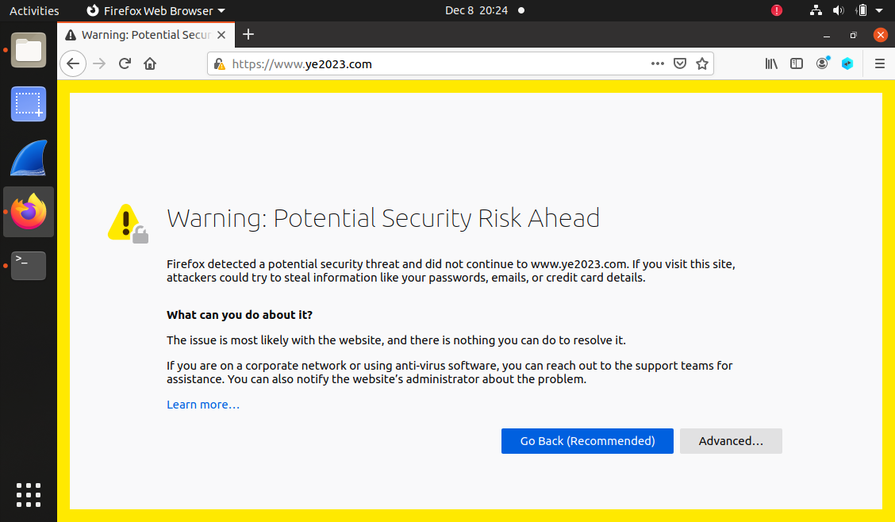
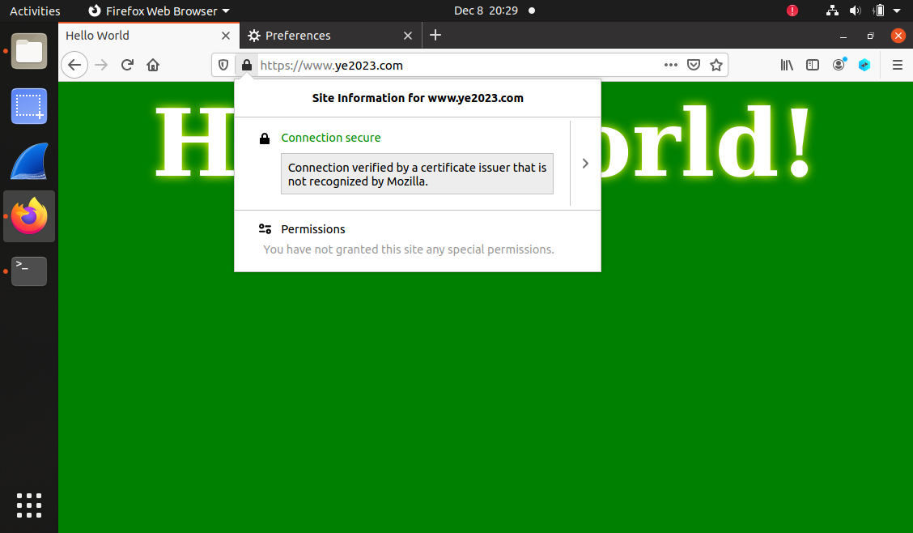

# Seed Labs - Public-Key Infrastructure Lab

## Setup

* De maneira a preparar as nossas máquinas virtuais para este *lab*, adicionamos novas entradas ao ficheiro `/etc/hosts` e iniciamos o *container* fornecido com `dcbuild && dcup`
```
10.9.0.80 www.bank32.com
10.9.0.80 www.ye2023.com
```
## Tarefa 1: Tornar-se uma Autoridade Certificada (CA)

* O objetivo desta tarefa é criar uma nova Autoridade Certificada - para tal, seguimos os seguintes passos, dentro da nossa pasta de trabalho local:

1. Configurar o OpenSSL
    - Copiamos o ficheiro de configuração de certificados para o diretório local usando `cp /usr/lib/ssl/openssl.cnf .` e descomentamos a linha `unique_subject`
    
    - Criamos os diretórios `demoCA` e `demoCA/newcerts`, usando `mkdir -p demoCA/newcerts`
    - Entramos no diretório `demoCA`, usando `cd demoCA`
    - De seguida, criamos a base de dados `index.txt`, usando `touch index.txt`
    - Finalmente, criamos o ficheiro `serial`, usando `echo 1000 > serial`

2. Fazer a configuração da CA, utilizando `openssl req -x509 -newkey rsa:4096 -sha256 -days 3650 -keyout ca.key -out ca.crt`
    - Neste processo, utilizamos os seguintes dados:
        ```
        - passphrase: dees
        - nome do país: PT
        - região: Porto
        - cidade: Porto
        - organização: FEUP
        - secção: UP
        - nome: l14g01
        - email: l14g01@example.com
        ```

3. Descodificamos o certificado X509 e a chave RSA, apenas para ver o seu conteúdo:
    ```
    openssl x509 -in ca.crt -text -noout
    open ssl rsa -in ca.key -text -noout
    ```

* A parte do certificado que indica que é um certificado CA é a secção `Certificate > Data > X509v3 extensions > X509v3 Basic Constraints`, na qual existe um atributo/propriedade `CA` que está a verdadeiro:

    

* Podemos observar que na secção `X509v3 extensions`, existem dois identificadores de chave: o *Subject Key Identifier* e o *Authority Key Identifier* - como ambos são iguais, significa que a autoridade é o sujeito e, como tal, este certificado é ***self-signed***

    

* Ao analisarmos o conteúdo do certificado e o conteúdo da chave, podemos tirar as seguintes conclusões:
    - O módulo `n` encontra-se secção `modulus`
    
    
    
    - O expoente público `e` e o expoente privado `d` encontram-se nas secções `publicExponent` e `privateExponent`, respetivamente
    
    
    
    - Os dois números secretos estão nas secções `prime1` e `prime2`
    
    

## Tarefa 2: Gerar um Pedido de Certificado para o Nosso Servidor *Web*

* Através do comando `openssl req -newkey rsa:2048 -sha256 -keyout server.key -out server.csr -subj "/CN=www.ye2023.com/O=Ye2023 Inc./C=PT" -passout pass:dees -addext "subjectAltName = DNS:www.ye2023.com, DNS:www.ye2023A.com, DNS:www.ye2023B.com"`, geramos um pedido de certificado para o nosso servidor *web*

* Isto efetuou um CSR para o domínio `www.ye2023.com`, presente no ficheiro `server.csr`

* Foram também adicionados alguns nomes alternativos ao pedido, o que significa que o certificado gerado também funcionará com os domínios `www.ye2023A.com` e `www.ye2023B.com`

## Tarefa 3: Gerar um Certificado para o nosso servidor

* Para gerar um certificado para o nosso servidor `www.ye2023.com`, foi necessário:

1. No ficheiro `openssl.cnf`, descomentar a linha:
    ```
    [CA_default]
    ...
    copy_extensions = copy
    ```

2. Criar o certificado, usando o comando `openssl ca -config openssl.cnf -policy policy_anything -md sha256 -days 3650 -in server.csr -out server.crt -batch -cert ca.crt -keyfile ca.key`
    - Foi criado um ficheiro `server.crt` com o certificado para o servidor, assinado pela CA
    

3. Após correr o comando `openssl x509 -in server.crt -text -noout`, podemos verificar que os nomes alternativos estão incluídos no conteúdo do certificado
    

## Tarefa 4: Lançar o Certificado num *Website* HTTPS *Apache-Based*

* Começamos por configurar o servidor *Apache*, criando o ficheiro `ye2023_apache_ssl.conf`, dentro da pasta partilhada `volumes`

* Seguindo o exemplo do *bank32*, o nosso ficheiro de configuração ficou o seguinte:
```
<VirtualHost *:443> 
    DocumentRoot /var/www/bank32
    ServerName www.ye2023.com
    ServerAlias www.ye2023A.com
    ServerAlias www.ye2023B.com
    DirectoryIndex index.html
    SSLEngine On 
    SSLCertificateFile /volumes/server.crt
    SSLCertificateKeyFile /volumes/server.key
</VirtualHost>

<VirtualHost *:80> 
    DocumentRoot /var/www/bank32
    ServerName www.ye2023.com
    DirectoryIndex index_red.html
</VirtualHost>

# Set the following gloal entry to suppress an annoying warning message
ServerName localhost
```

* Movemos também os ficheiros `server.crt` e `server.key` (gerados anteriormente) para a parta partilhada `volumes`

* Na *shell* do *container*, copiamos o ficheiro de configuração anteriormente criado para a pasta `/etc/apache2/sites-available` (com `cp volumes/ye2023_apache_ssl.conf /etc/apache2/sites-available`), ativamos o *site* nele descrito (correndo `a2ensite ye2023_apache_ssl` e `service apache2 reload`) e iniciamos o servidor *Apache*, usando `service apache2 start`

* Acedemos ao *site* `https://www.ye2023.com`, mas verificamos que a ligação era insegura



* Apesar do prefixo `https`, a ligação ao *site* não era segura porque não estava encriptada, dado que ainda não tinha sido adicionado o certificado criado anteriormente às autoridades confiadas pelo *browser*

* Então, adicionamos o certificado CA gerado (`ca.crt`) ao *browser*, em `about:preferences#privacy -> Certificates -> View Certificates -> Authorities -> Import`


* Assim, verificamos que a ligação passou a ser segura



## Tarefa 5: Lançar um Ataque *Man-In-The-Middle*

* Nesta tarefa, escolhemos o `www.google.com` para realizar as etapas

1. Começamos por adicionar a seguinte linha ao `/etc/hosts`, de maneira a mapear o endereço do *site* no endereço IP do *container*:
    ```
    10.9.0.80   www.google.com
    ```

2. Tal como na tarefa anterior, criamos um ficheiro de configuração (`google_apache_ssl.conf`) na pasta partilhada e copiamo-lo para a pasta `/etc/apache2/sites-available`, ativando o *site* e reiniciando o servidor através dos comandos corridos anteriormente
    ```
    <VirtualHost *:443> 
        DocumentRoot /var/www/bank32
        ServerName www.google.com
        ServerAlias www.ye2023A.com
        ServerAlias www.ye2023B.com
        DirectoryIndex index.html
        SSLEngine On 
        SSLCertificateFile /volumes/server.crt
        SSLCertificateKeyFile /volumes/server.key
    </VirtualHost>

    <VirtualHost *:80> 
        DocumentRoot /var/www/bank32
        ServerName www.google.com
        DirectoryIndex index_red.html
    </VirtualHost>

    # Set the following gloal entry to suppress an annoying warning message
    ServerName localhost
    ```

3. Se tentarmos entrar na página `www.google.com`, o *site* não poderá ser acedido sem avisos, já que estamos a usar o mesmo certificado que usamos para `ye2023.com` - este certificado garante apenas uma navegação segura e encriptada para `www.ye2023.com`, `www.ye2023A.com` e `www.ye2023B.com`, mas não para `www.google.com`


## Tarefa 6: Lançar um Ataque *Man-In-The-Middle* com uma CA Comprometida

* Nesta tarefa queremos provar que, uma vez comprometida a chave privada da CA, conseguimos gerar vários certificados para diferentes *websites* sob a mesma CA

* Como a nossa máquina já confia na CA, qualquer certificado que gerarmos usando esta CA também será confiável

* Portanto, podemos criar, por exemplo, um certificado para `www.google.com` sob a nossa CA e aceder ao *site* sem nenhum aviso do *browser*

* Para tal, de acordo com as tarefas anteriores, basta:

1. Criarmos um novo pedido de certificado para `www.google.com`:
    ```
    openssl req -newkey rsa:2048 -sha256 -keyout server.key -out server.csr -subj "/CN=www.google.com/O=google ORG/C=PT" -passout pass:dees
    ```

2. Gerarmos um novo certificado:
    ```
    openssl ca -config openssl.cnf -policy policy_anything -md sha256 -days 3650 -in server.csr -out server.crt -batch -cert ca.crt -keyfile ca.key
    ```

3. Movermos os ficheiros `server.crt` e `server.key` para a pasta partilhada `volumes`, substituindo os ficheiros anteriormente lá existentes

4. Reiniciar o servidor Apache

* Conseguimos, então, aceder ao *site* sem qualquer aviso, através de uma ligação aparentemente segura:


    
# CTF 11

* Depois de analisarmos o enunciado do CTF e o ficheiro `challenge.py`, verificamos que se tratava de uma cifra baseada em RSA, que assenta no problema matemático da fatorização de números inteiros

* Assim, o primeiro passo passou por correr o comando `nc ctf-fsi.fe.up.pt 6004`, tendo recebido os valores ***n*** e ***e***, bem como o ***ciphertext***, que corresponde à *flag* cifrada


* Os valores ***e*** e ***n*** foram os utilizados na cifra RSA que encriptou a *flag*, sendo a *flag* cifrada o resultado de a elevar ao expoente ***e***, módulo ***n***

* De seguida, ao analisarmos o mecanismo de encriptação e desencriptação, concluimos que precisávamos de uma função que testasse se um número era primo ou não

* Nesse sentido, e por se tratarem de números muito grandes, optamos por utilizar o algoritmo de Miller-Rabin, cuja implementação se encontra abaixo

```python
def miller_rabin(n):

    if n == 2:
        return True

    if n % 2 == 0:
        return False

    r, s = 0, n - 1
    while s % 2 == 0:
        r += 1
        s //= 2
    for _ in xrange(8):
        a = random.randrange(2, n - 1)
        x = pow(a, s, n)
        if x == 1 or x == n - 1:
            continue
        for _ in xrange(r - 1):
            x = pow(x, 2, n)
            if x == n - 1:
                break
        else:
            return False
    return True
```

* Deste modo, tendo em conta a informação dada no enunciado, ("p é um primo próximo de 2<sup>512</sup> e q é um primo próximo de 2<sup>513</sup>), descobrimos os valores de ***p*** e ***q*** usando a função acima e uma função auxiliar que percorria todos os números desde 2<sup>512</sup> e 2<sup>513</sup> até encontrar um primo

```python
def find_prime(n):
    while True:
        if miller_rabin(n):
            return n
        n += 1
        
p = 13407807929942597099574024998205846127479365820592393377723561443721764030073546976801874298166903427690031858186486050853753882811946569946433649006084823
q = 26815615859885194199148049996411692254958731641184786755447122887443528060147093953603748596333806855380063716372972101707507765623893139892867298012169683
```	

* Com isto, conseguimos usar o ***p***, o ***q*** e a equação dada no enunciado ("ed % (p-1)(q-1) = 1") para calcularmos o valor de ***d***

```python
d = pow(e, -1, ((p-1)*(q-1)))
```

* Assim, este valor ***d*** pode ser usado para descobrir se os valores de ***n*** e ***e*** são válidos, ou seja, se são os valores que foram usados para cifrar a *flag*, bastando para isso tentar decifrar ***ciphertext*** elevando-o a ***d*** e calculando o módulo ***n***

* Para isto, tivemos de utlizar a função `dec` e passar como primeiro parâmetro o ***ciphertext*** convertido para *bytes* e para decimal, operações inversas às que foram feitas pela função `enc`

```python
flag = unhexlify(b"6434333639326535636564663231393237396263333832656631346333383236636436373834623364393661396164636636336338663964653836646266343635306264653236383061623431666266383463653334343762393666656564633436383136616536336561373562343636356533373230373564316631313864373237613763316435353935386533633935323037346663323461306234363438616164343436336637343664373838636461613836396334343135363135316437396231313431343864313466663437346165633865383561356533303035303964663931623534653839353839343334366665616566343133616133373630303030303030303030303030303030303030303030303030303030303030303030303030303030303030303030303030303030303030303030303030303030303030303030303030303030303030303030303030303030303030303030303030303030303030303030303030303030303030303030303030303030303030303030303030303030303030303030303030303030303030303030303030303030303030303030303030303030303030303030303030303030303030303030303030303030303030303030303030303030303030303030303030303030303030303030303030303030303030303030303030303030303030303030303030303030")
n = 359538626972463181545861038157804946723595395788461314546860162315465351611001926265416954644815072042240227759742786715317579537628833244985694861278987734749889467798189216056224155419337614971247810502667407426128061959753492358794507740889756004921248165191531797899658797061840615258162959755571367021109
e = 65537
p = 13407807929942597099574024998205846127479365820592393377723561443721764030073546976801874298166903427690031858186486050853753882811946569946433649006084823
q = 26815615859885194199148049996411692254958731641184786755447122887443528060147093953603748596333806855380063716372972101707507765623893139892867298012169683
d = pow(e, -1, ((p-1)*(q-1)))
print(dec(flag, d, n))
```	

* Assim, descobrimos a flag `flag{eff249699a91b6056377745baf64417d}`


