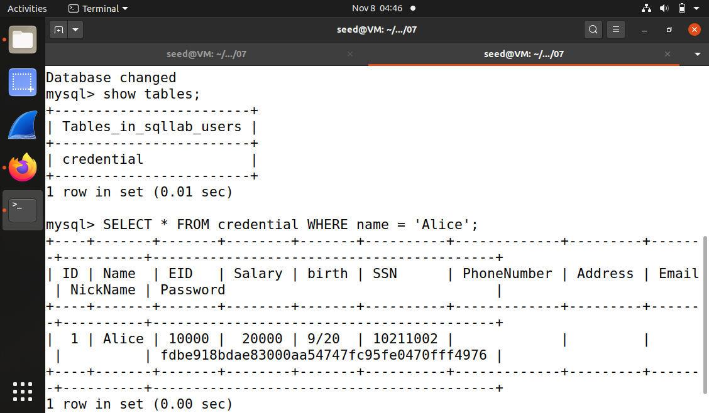
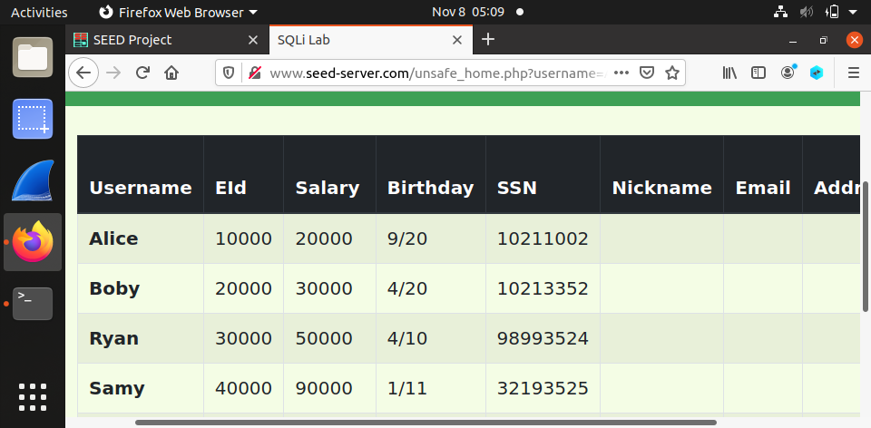
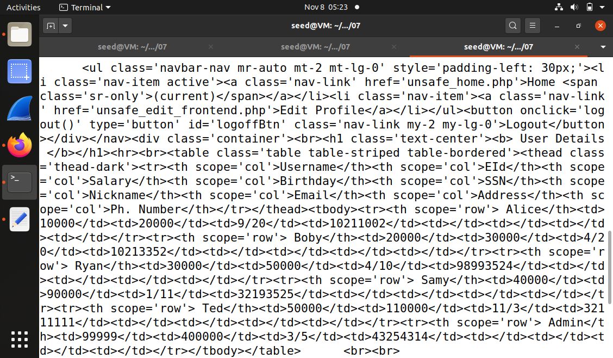
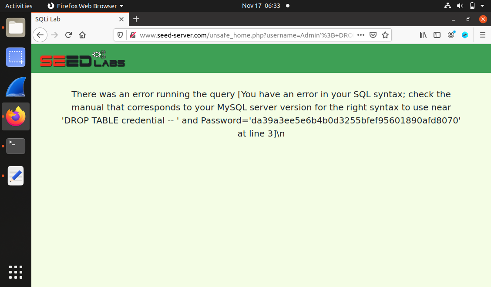
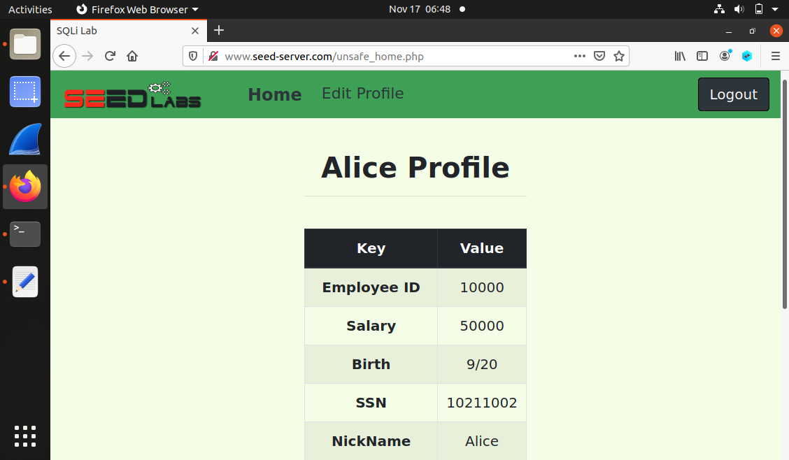
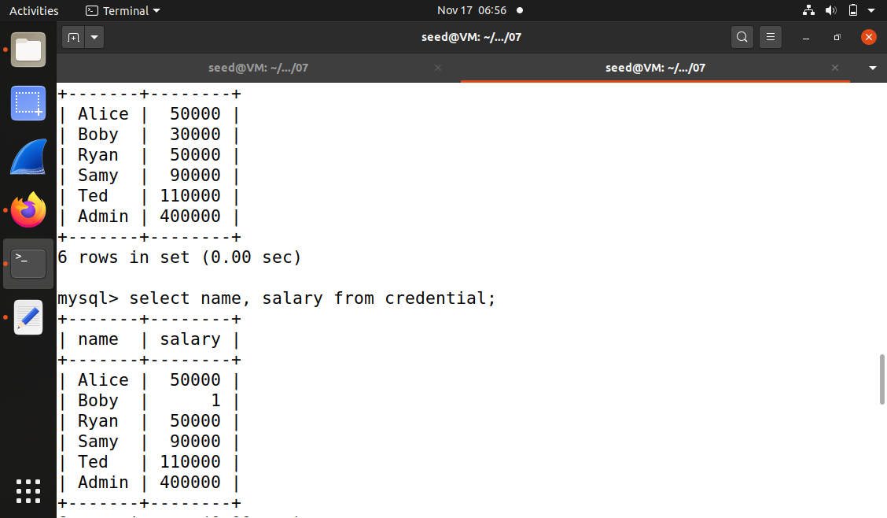
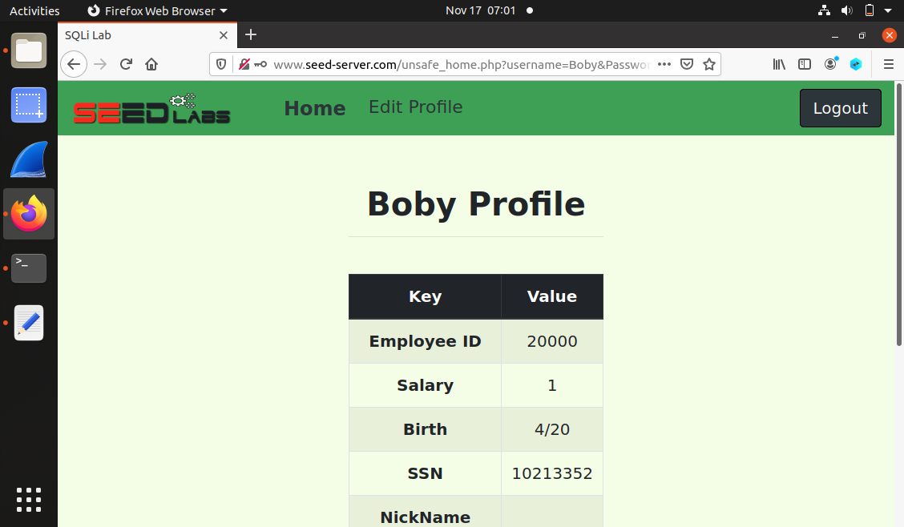
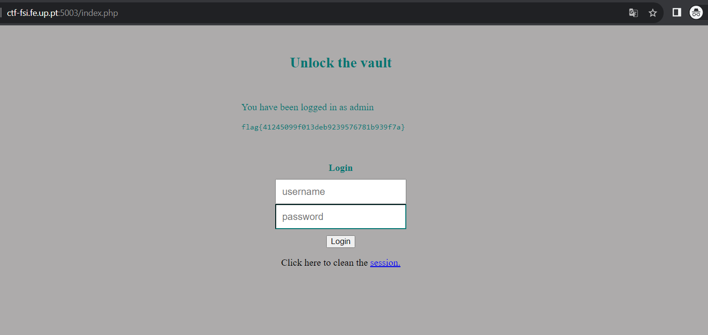

# SQL Injection Attack Lab

## Task 1: Get Familiar with SQL Statements

* Depois de configurarmos o ambiente de desenvolvimento, corremos o comando *dockps* que nos indicou os IDs dos containers que foram `ac3ed20667e0 mysql-10.9.0.6` e `303b990b452e www-10.9.0.5`

* De seguida, corremos o comando *docksh ac3* para entrar no container do mysql

* Na shell do container corremos o comando *mysql -u root -pdess* para interagir com a base de dados

* Após o ponto anterior, corremos *use sqllab_users;* para consultar a base de dados e *show tables;* para ver as tabelas presentes na base de dados, neste caso a tabela *credential*

* Para imprimir a informação de perfil da Alice, fizemos *select * from credential where Name='Alice';* e obtivemos o seguinte resultado:



## Task 2: SQL Injection Attack on SELECT Statement

### Task 2.1: SQL Injection Attack from webpage

* Ao abrimos o url *www.seed-server.com* deparamo-nos com a página de login e tentamos fazer login com o username do *Admin*

* Analisando o código php, verificamos que podíamos realizar um ataque de *SQL Injection* 

```php
    $sql = "SELECT id, name, eid, salary, birth, ssn, phoneNumber, address, email,nickname,Password

    FROM credential

    WHERE name= '$input_uname' and Password='$hashed_pwd'";
```

* Assim, tentamos criar um ataque onde no campo do username escrevemos `Admin' -- `, de maneira a comentar a verificação da palavra passe na *query sql* e fizemos *Login*

* Deste modo, tivemos acesso à informação de todos os utilizadores



### Task 2.2: SQL Injection Attack from command line

* Após uma tentativa falhada de Login, percebemos no *url* do site que o *login* era feito com recurso ao método *GET*

* Assim, com o comando *curl* conseguimos fazer um ataque de *SQL Injection* colocando o username do Admin desta forma: `Admin' -- `e assim conseguimos obter a informação de todos os utilizadores outra vez


```bash
curl http://www.seed-server.com/unsafe_home.php?username=Admin%27+--+&Password= 
```



### Task 2.3: Append a new SQL statement

* Analisando o código, verificamos que só é possível realizar uma *query* de cada vez porque a função de php usada é a *mysqli::query* 

* Assim, isto não permite que o atacante coloque um *;* no fim da primeira *query* para executar uma segunda *query*

* Se a função php fosse do tipo *msqli::multiquery* já seria possível realizar mais que uma *query* e assim realizar operações de *insert*, *delete* e *update*



```php
if (!$result = $conn->query($sql))
```

## Task 3: SQL Injection Attack on UPDATE Statement

### Task 3.1: Modify your own salary

* Para modifiar o salário da Alice colocamos o username `Alice' -- ` e entramos no seu perfil

* De seguida, usando a query abaixo, alteramos o seu salário, colocando no campo nickname  ```Alice', salary='50000 ```, fazendo com que o valor do salário passasse como uma string, tendo em conta que não existe diferenciação de tipos em sql

```sql
    $sql = "UPDATE credential SET nickname='$input_nickname',email='$input_email',address='$input_address',PhoneNumber='$input_phonenumber' where ID=$id;"
```



### Task 3.2: Modify other people’ salary

* Para modificar o salário do Boby, usando o perfil da Alice e a mesma query do ponto anterior, colocamos no campo nickname ``` ', salary=1 where name='Boby' -- ```, que nos permitiu alterar o salário do Boby para 1 sem alterar o seu nickname



### Task 3.3: Modify other people’ password

* Como pertendiamos modificar a palavra passe do Boby para *password* e sabiamos que a função de *hash* usanda era *SHA 1*, verificamos que o *hash* da palavra passe *password* era *5baa61e4c9b93f3f0682250b6cf8331b7ee68fd8*

* Usamos o perfil da Alice e a query do ponto anterior, colocamos no campo nickname ``` ', password='5baa61e4c9b93f3f0682250b6cf8331b7ee68fd8' where name='Boby' -- ```, que nos permitiu alterar a palavra passe do Boby para *password* sem alterar o seu nickname

* Tendo em conta as imagens abaixo, com a palavra passe *password* conseguimos fazer login com o username *Boby* e aceder ao seu perfil




# CTF 8 - SQL Injection

* Observando o código php, verificamos que a query executada a cada tentativa de login era

```php
    $query = "SELECT username FROM user WHERE username = '".$username."' AND password = '".$password."'";
```

* O input que podemos facilmente manipular é o *username*: nesse campo, podemos utilizar os caracteres especiais `'` e `--`, para fechar o campo *username* e para comentar o resto da query, respetivamente

* Para além disto, reparamos que o campo *password* era obrigatório, pelo que o preenchemos com um caracter aleatório

* A query SQL efetivamente executada com a tentativa de login maliciosa foi:

```sql
SELECT username
FROM user
WHERE username = 'admin' -- AND password = 'p'
```

* Esta query permite fazer login porque seleciona o utilizador cujo *username* é "admin", ignorando o campo *password*

* Conseguimos obter a flag *flag{41245099f013deb9239576781b939f7a}* 


