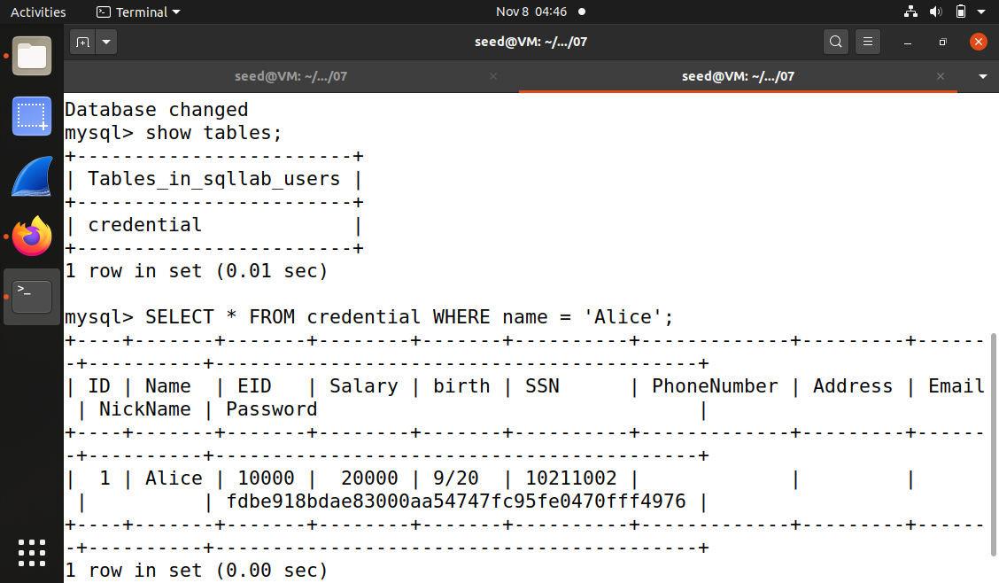
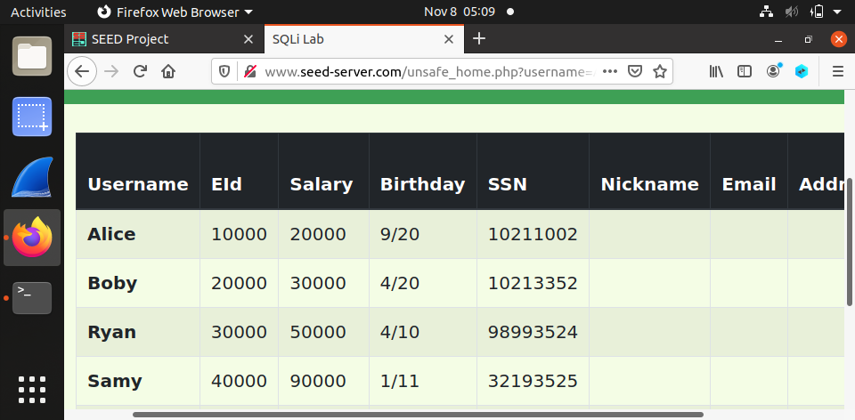
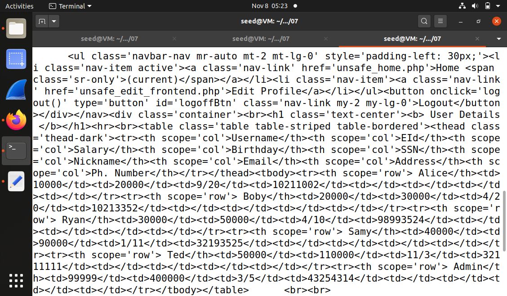
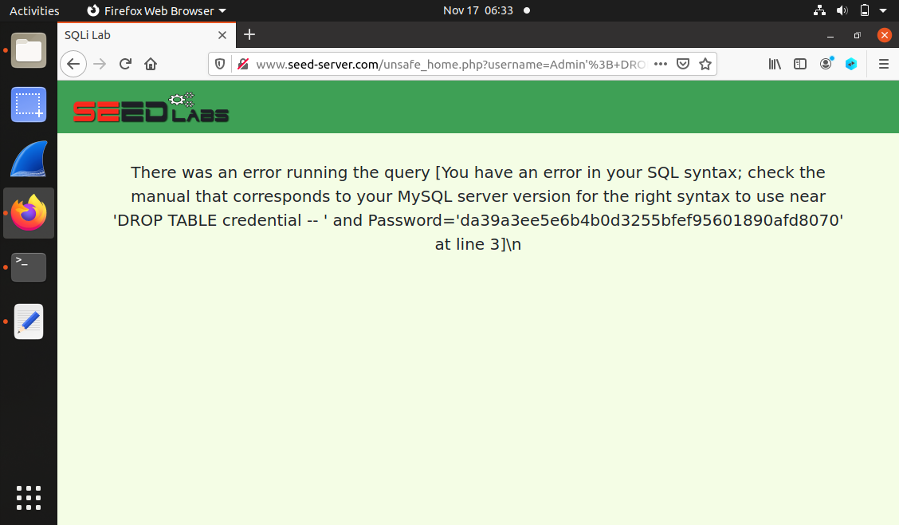
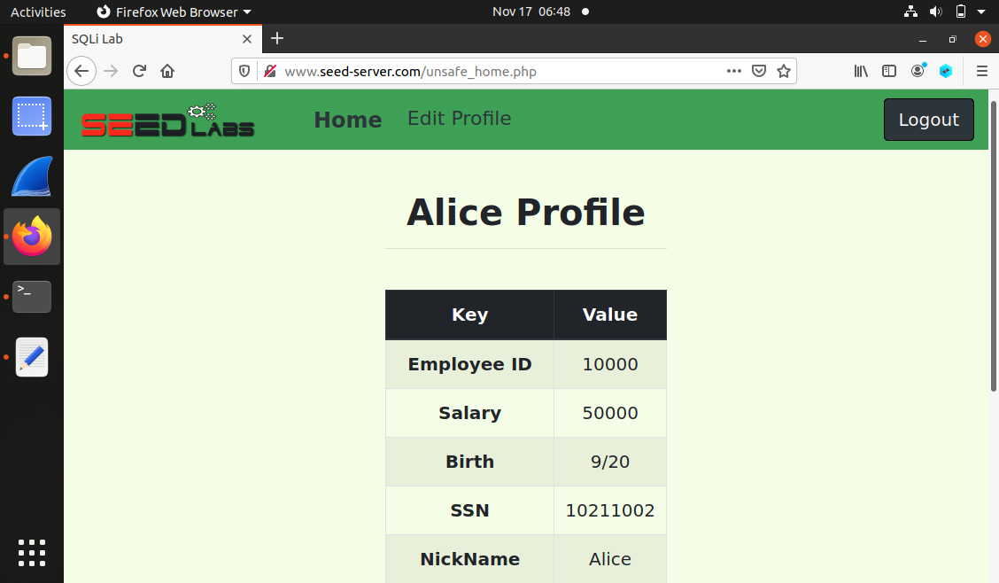
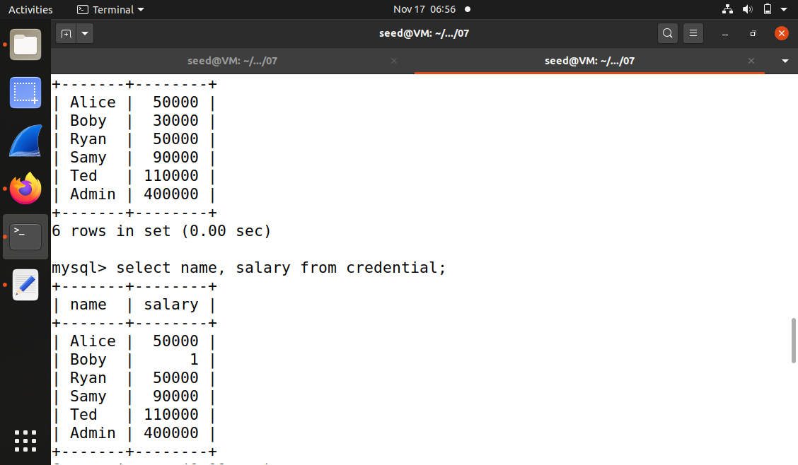
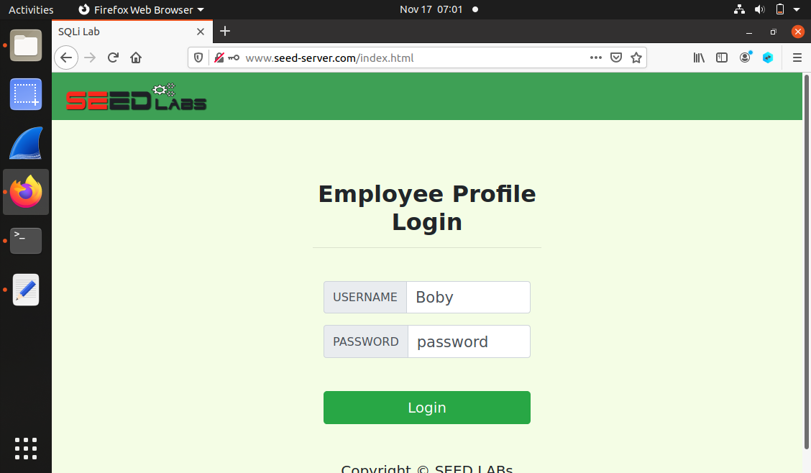
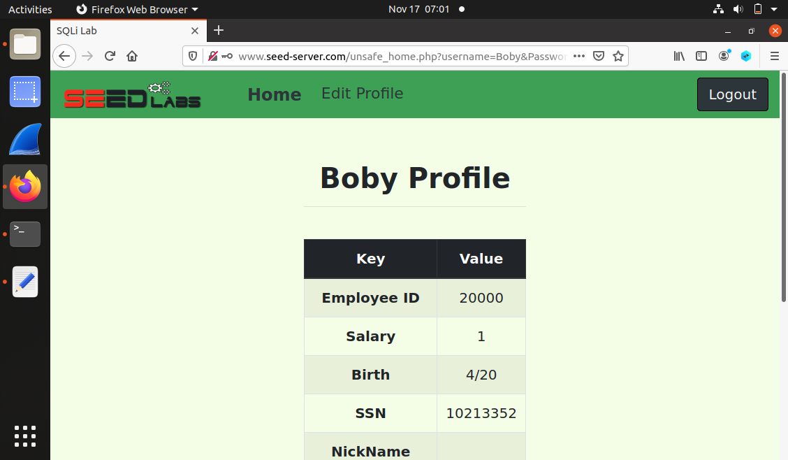
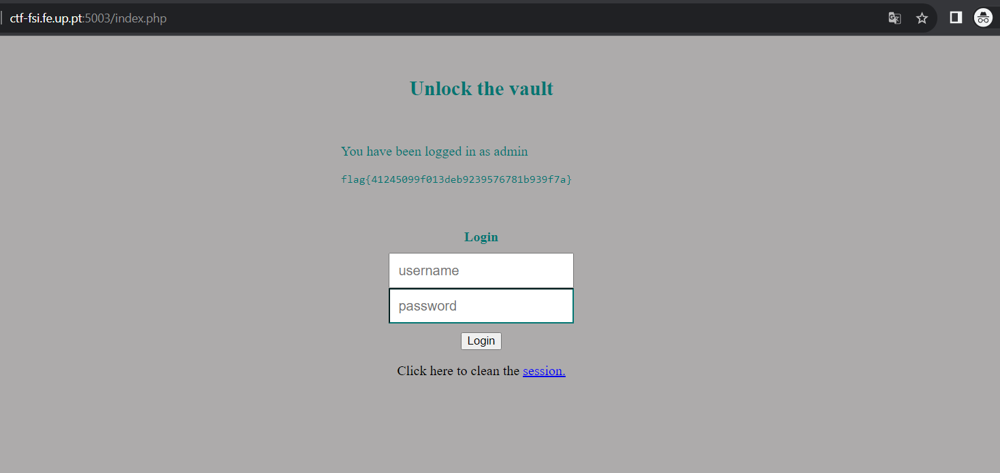

# SEED Labs - SQL Injection Attack Lab

## Tarefa 1: Familiarizar-se com SQL Statements

* Depois de configurarmos o ambiente de desenvolvimento, corremos o comando `dockps`, que nos indicou os IDs dos containers: `ac3ed20667e0 mysql-10.9.0.6` e `303b990b452e www-10.9.0.5`

* De seguida, corremos o comando `docksh ac3` para entrar no *container* do MySQL

* Na *shell* do *container*, corremos o comando `mysql -u root -pdess` para interagir com a base de dados

* Após o ponto anterior, corremos `use sqllab_users;` para consultar a base de dados e `show tables;` para ver as tabelas nela presentes, neste caso a tabela `credential`

* Para imprimir a informação de perfil da Alice, fizemos `select * from credential where Name='Alice';` e obtivemos o seguinte resultado



## Tarefa 2: Ataque de SQL Injection com um SELECT Statement

### Tarefa 2.1: Ataque de SQL Injection a partir de uma página web

* Ao abrirmos o URL *www.seed-server.com*, deparamo-nos com a página de *login* e tentamos fazer *login* com o *username* do Admin

* Analisando o código PHP, verificamos que podíamos realizar um ataque de *SQL Injection* porque o *input* do utilizador não era sanitizado

```php
$sql = "SELECT id, name, eid, salary, birth, ssn, phoneNumber, address, email, nickname, Password

FROM credential

WHERE name = '$input_uname' and Password = '$hashed_pwd'";
```

* Assim, tentamos criar um ataque em que no campo *username* escrevemos `Admin' -- `, de maneira a comentar a verificação da palavra-passe na *query* SQL, e fizemos *login*

* Deste modo, tivemos acesso à informação de todos os utilizadores



### Tarefa 2.2: Ataque de SQL Injection a partir da linha de comandos

* Após uma tentativa falhada de *login*, percebemos no URL do site que o *login* era feito com recurso ao método GET

* Assim, com o comando `curl` conseguimos fazer um ataque de *SQL Injection*, colocando o username do Admin desta forma: `Admin' -- ` 

```
curl http://www.seed-server.com/unsafe_home.php?username=Admin%27+--+&Password= 
```

* Assim, conseguimos obter novamente a informação de todos os utilizadores



### Tarefa 2.3: Acrescentar um novo SQL statement

* Analisando o código, verificamos que só é possível realizar uma *query* de cada vez, porque a função de PHP usada é `mysqli::query`

```php
if (!$result = $conn->query($sql))
```

* Assim, isto não permite que o atacante coloque um `;` no final da primeira *query* para executar uma segunda *query*



* Se a função PHP fosse do tipo `mysqli::multiquery` já seria possível realizar mais do que uma *query* e assim realizar operações de *insert*, *delete* e *update*

## Tarefa 3: Ataque de SQL Injection com um UPDATE Statement

### Tarefa 3.1: Modificar o próprio salário

* Para modifiar o salário da Alice, colocamos o *username* `Alice' -- ` e entramos no seu perfil

* De seguida, usando a *query* abaixo, alteramos o seu salário, colocando no campo *nickname*  `Alice', salary='50000`, fazendo com que o valor do salário passasse como uma *string*, tendo em conta que não existem tipos diferentes em SQL

```php
$sql = "UPDATE credential SET nickname='$input_nickname',email='$input_email',address='$input_address',PhoneNumber='$input_phonenumber' where ID=$id;"
```



### Tarefa 3.2: Modificar o salário de outro

* Para modificar o salário do Boby, usando o perfil da Alice e a mesma *query* do ponto anterior, colocamos no campo *nickname* `', salary=1 where name='Boby' -- `, o que nos permitiu alterar o salário do Boby para 1 sem alterar o seu *nickname*



### Tarefa 3.3: Modificar a palavra-passe dos outros

* Como pretendíamos modificar a palavra-passe do Boby para *password* e sabíamos que a função de *hash* usanda era SHA 1, verificamos que o *hash* da palavra-passe *password* era *5baa61e4c9b93f3f0682250b6cf8331b7ee68fd8*

* Usando o perfil da Alice e a *query* do ponto anterior, colocamos no campo *nickname* `', password='5baa61e4c9b93f3f0682250b6cf8331b7ee68fd8' where name='Boby' -- `, o que nos permitiu alterar a palavra-passe do Boby para *password* sem alterar o seu *nickname*

* Como comprovam as imagens abaixo, com a palavra-passe *password* conseguimos fazer *login* com o *username* Boby e aceder ao seu perfil





# CTF 8

* Observando o código PHP, verificamos que a *query* executada a cada tentativa de *login* era

```php
$query = "SELECT username FROM user WHERE username = '".$username."' AND password = '".$password."'";
```

* O *input* que podemos facilmente manipular é o *username*: nesse campo, podemos utilizar os caracteres especiais `'` e `--`, para fechar o campo *username* e para comentar o resto da query, respetivamente

* Para além disto, reparamos que o campo *password* era obrigatório, pelo que o preenchemos com um caracter aleatório

* A *query* SQL efetivamente executada com a tentativa de *login* maliciosa foi:

```sql
SELECT username
FROM user
WHERE username = 'admin' -- AND password = 'p'
```

* Esta *query* permite fazer *login* porque seleciona o utilizador cujo *username* é "admin", ignorando o campo *password*

* Assim, onseguimos obter a *flag* `flag{41245099f013deb9239576781b939f7a}`


